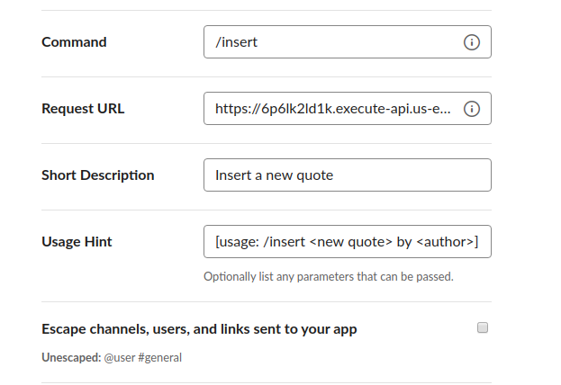
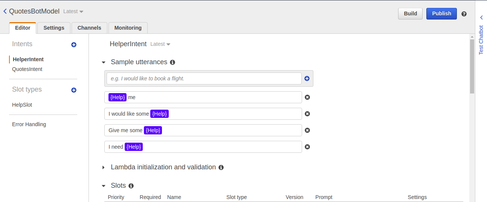

#HOW-TO SiPY
###Prerequisiti:
- Account AWS attivo configurato con un ruolo IAM;
- <b>AWS CLI</b> correttamente installato sulla propria macchina (si considera un SO Linux-like);
- Account <b>Slack</b> attivo collegato correttamente ad un workspace.

###Lato Client
La comunicazione con il bot è completamente integrata all'interno della chat di <b>Slack</b> con uno dei canali del workspace di lavoro.
Per creare un'applicazione bot basta accedere al workspace in http://api.slack.com e:
- aggiungere un Bot User all'interno degli Bot Users;
- attivare gli Interactive Components con un link provvisorio fittizio;
- salvare i dati corrispondenti a ID client/Client Secret/Client Secret in Basic Information.

Per creare un <em>comando Slack</em> che è utilizzato per l'inserimeto delle nuove citazioni:
- accedere alla SiPY app appena creata in https://api.slack.com/apps 
- nel menù sulla sinistra, selezionare <em>Slash Commands</em> e cliccare sul bottone <em>Create New Command</em>
- compilare i campi come mostrato in figura 
- in <em>Request URL</em> va inserito il canale di collegamento con le API Gateway, che verranno create successivamente. (<b>NOTA</b> vedi la sezione "Channeling Client-Server")
            

###Lato Server
Per creare un'istanza delle risorse Lambda, SNS e API Gateway usate nel lato server dell'applicazione SiPY è necessario deployare il template YAML, 
in cui sono elencate tutte le risorse necessarie a ricreare la logica dell'applicazione con le relative specifiche.

- creazione del bucket S3: è necessario uno storage in cui caricare il codice eseguibile delle funzioni lambda 
    (<b>NOTA</b>: i bucket devono avere un nome esclusivamente lower-case)

```$ aws s3 mb s3://<sipybucket> ``` 

- creazione del packaged-yaml: è la versione effettivamente utilizzata da <b>AWS CLI</b> per il deploy delle risorse in cloud 

```$ aws cloudformation package --template-file ./template.yml --s3-bucket <sipybucket> --output-template-file ./packaged-template.yml```

- creazione dello stack: a partire dal file appena creato, si genera una stack che rappresenta tutte le risorse nel servizio <b>CloudWatch</b>

```$ aws cloudformation deploy --template-file ./packaged-template.yml --stack-name <sipystack> --capabilities CAPABILITY_NAMED_IAM```

- pinging of stack state: per assicurarsi della corretta istanziazione delle risorse 
    (<b>NOTA</b>: in caso di errore cercare la voce <em>ResourceStatusReason</em>)
    
```$ aws cloudformation describe-stack-events --stack-name <sipystack>```

L'ultima risorsa necessaria è il modello del bot creato attraverso il servizio Lex:

- accedere alla <b>AWS console </b> al link https://us-east-1.console.aws.amazon.com/lex/
- cliccare sul bottone <em>Actions</em> e successivamente <em>Import</em>
- cliccare sul bottone <em>Browse</em> e navigare fino alla directory contente il progetto per selezionare il file QuotesBotModel.zip (./sources/QuotesBotModel.zip)
- cliccare sul bottone <em>Build</em> e successivamente <em>Publish</em>, eventualmente scegliendo un nuovo Alias



A questo punto è necessario configurare  il canale di comunicazione tra il lato client Slack e il lato server Lex
 

###Channeling Client-Server
- Seguendo il tutorial di AWS Lex https://docs.aws.amazon.com/it_it/lex/latest/dg/slack-bot-assoc-create-assoc.html è possibile validare i canali di comunicazione tra Slack e Lex utilizzando i token necessari.

- Per attivare il canale del <em>Slash Command</em> per inserire una nuova citazione
    1.  accedere alle risorse API Gateway create nella sezione "Lato server" nella <b>console AWS</b>
    2.  cliccare sulla voce <b>Fasi</b> nel menù a tendina sulla sinistra, in corrispondenza del metodo POST 
    3.  copiare il valore URL in <b>Richiama URL</b> e inserirlo nel <em>Request URL</em> del comando Slack creato nella sezione "Lato client"
    4.  accedere alle impostazioni dell'app in http://api.slack.com e cliccare in <em>Incoming Webhooks</em> nel menù sulla sinistra
    5.  attivare il toggle e copiare il link autogenerato all'interno delle variabili di ambiente della Lambda "FindQuoteByTags" in corrispondenza della voce <b>SLACK_CHANNEL</b> 
  
###Database
Le citazioni sono già presenti in un cluster in MongoDB Atlas (https://cloud.mongodb.com) e non hanno bisogno di ulteriori configurazioni. 

Per ricreare un cluster è necessario:
   1.  registrarsi creando un account in MongoDB Atlas
   2.  caricare il file "quotes.json"
   3.  creare un Admin con i privilegi massimi per la gestione del cluster
Per creare la connessione è sufficiente cliccare sul bottone <em>connect</em> e <em>connect your application</em>.
L'URL <b>Connection String Only</b> è il valore da copiare all'interno delle variabili di ambiente in tutte le Lambda in corrispondenza della voce <b>MONGODB_ATLAS_CLUSTER_URI</b> 

<b>Nota</b>: il webhooks è generato per un singolo canale Slack: con un account di Slack premium sarebbe possibile distribuire in tutti i workspace l'applicazione, pubblicandola nel market place di slack, permettendo il download diretto in un qualunque workspace evitando il deploy manuale.


##HOW TO USE
Per iniziare una conversazione con SiPY aggiungere il bot nella chat di Slakc, premendo su "+" nel menù sulla sinistra sotto la voce "Apps". 
Comunicando con SiPY è possibile:
1.  richiedere una citazione in base ad una categoria e/o un autore: nel caso non si voglia scegliere una delle due specifiche (o entrambe) è sufficiente rispondere "any" alle domande che il bot farà;
2.  aggiungere una citazione: se la ricerca effettuata non ha prodotto risultati il bot suggerirà di effettuare l'inserimento di una citazione specificandone l'autore;
3.  chiedere aiuto: è la prima volta che chatti con SiPY e non sai cosa fare? Chiedigli un suggerimento!
